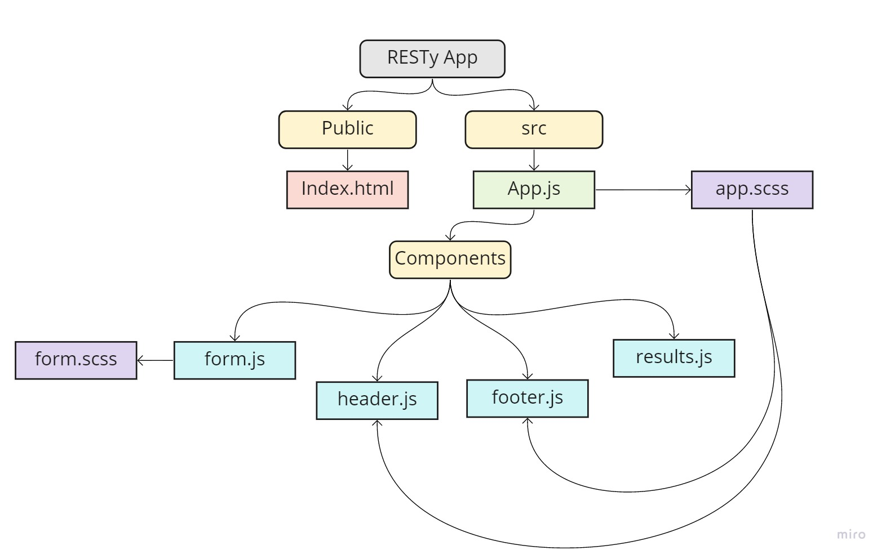
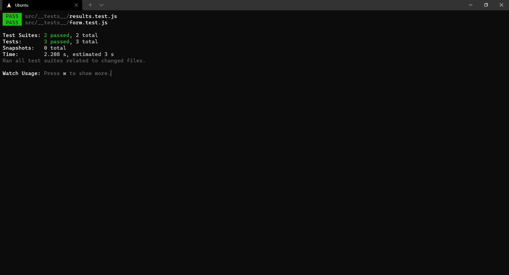
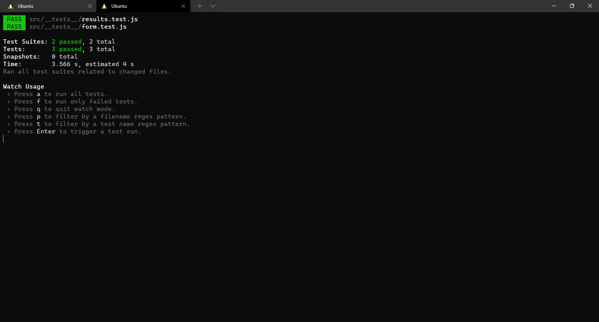

# RESTy App 

## Author : Sana Ishaqat

### Description :
#### Phase 1 Requirements

Today, we begin the first of a 4-Phase build of the RESTy application, written in React. In this first phase, our goal is to setup the basic scaffolding of the application, with intent being to add more functionality to the system as we go. This initial build sets up the file structure so that we can progressively build this application in a scalable manner.

### Links and Resources:

[Branch base](https://github.com/SanaIshaqat/resty/tree/base)

[code sand box Link LAB-26](https://codesandbox.io/s/funny-dawn-85sz6?file=/src/app.scss)

[pull request LAB-26](https://github.com/SanaIshaqat/resty/pull/1)

UML :

#### Phase 2 Requirements
In phase 2, we will be receiving user input in preparation of connecting to live APIs, using the useState() hook in our functional components

- The following user stories detail the major functionality for this phase of the project.

As a user, I want to enter the REST Method and URL to an API
As a user, I want to see a summary of my request as well as results returned from an API request in my browser in a readable format
Application Flow:

- User enters an API URL
Chooses a REST Method
Clicks the “Go” button
Application fetches data from the URL given, with the method specified
Displays the response headers and results separately
Both headers and results should be “pretty printed” JSON

### Links and Resources:

[Branch state](https://github.com/SanaIshaqat/resty/tree/state)

[code sand box Link LAB-27](https://codesandbox.io/s/jolly-wilson-sp41i)

[pull request LAB-27](https://github.com/SanaIshaqat/resty/pull/3)

UML :

Tests:

#### Phase 3 Requirements

In phase 3, we will be connecting RESTy to live APIs, fetching and displaying remote data. Our primary focus will be to service GET requests

The following user stories detail the major functionality for this phase of the project.

As a user, I want to enter the URL to an API and issue a GET request so that I can retrieve it’s data
As a user, I want to see the results returned from an API request in my browser in a readable format
Application Flow:

User enters an API URL
Chooses a REST Method
Clicks the “Go” button
Application fetches data from the URL given, with the method specified
Displays the response headers and results separately
Both headers and results should be “pretty printed” JSON

### Links and Resources:

[Branch effect-hook](https://github.com/SanaIshaqat/resty/tree/state)

[gh-pages Link LAB-28](https://sanaishaqat.github.io/resty/)

[pull request LAB-28](https://github.com/SanaIshaqat/resty/pull/4)

UML :

Tests:

